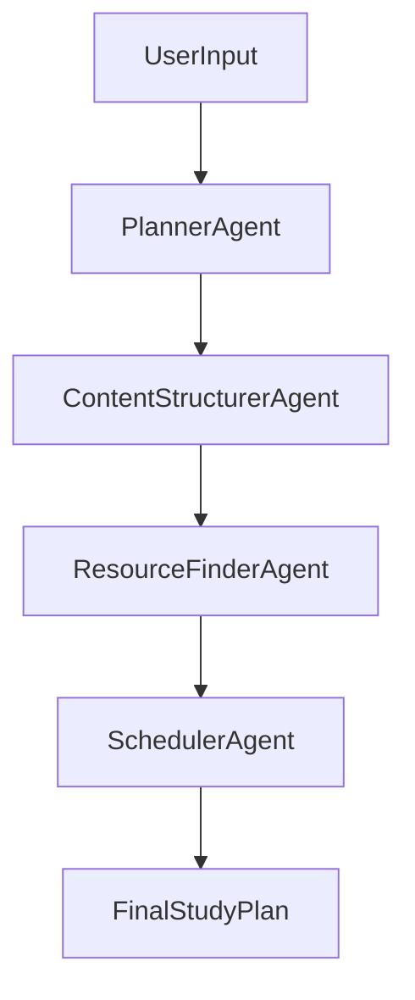
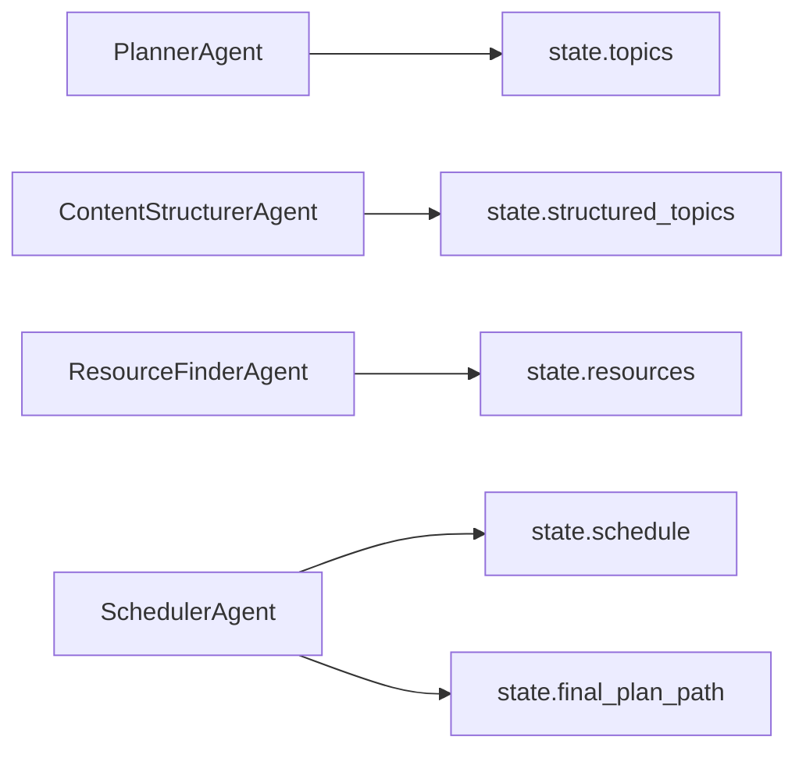

# Multi-Agent AI Study Planner

SE4010 CTSE Assignment 2 - Machine Learning

## Project Overview

This project builds a local-only Multi-Agent System (MAS) that converts a user goal such as:

`I want to learn Machine Learning in 2 weeks`

into a complete study output:

- topic decomposition
- topic structuring (beginner to advanced)
- resource mapping
- day-wise study schedule
- saved final plan artifact

The implementation is designed to satisfy:

- Multi-Agent orchestration (4 agents)
- custom Python tool usage
- explicit global state management
- AgentOps style observability
- automated evaluation scripts

## Architecture

### Agents

1. Planner Agent
2. Content Structurer Agent
3. Resource Finder Agent
4. Scheduler Agent

### Workflow



### State Transition Mapping



## Global State Contract

Defined in `state.py` as `StudyPlannerState`:

- `user_goal: str`
- `days: int`
- `topics: list[str]`
- `structured_topics: list[str]`
- `resources: dict[str, list[str]]`
- `schedule: dict[str, list[str]]`
- `final_plan_path: str`
- `trace_id: str`

Each stage owns one state section and passes it forward.

## Tools

Custom tools in `tools/`:

- `load_topics(subject)` - curated topic decomposition with fallback
- `organize_topics(topics)` - pedagogical ordering
- `get_resources(topic)` - hybrid retrieval:
  - curated local mapping
  - free public API (Wikipedia summary endpoint)
  - safe fallback search links
- `create_schedule(topics, days)` - day-wise topic scheduling
- `save_plan(plan, output_path)` - persist final JSON output

## Observability (AgentOps Evidence)

Structured traces are stored in `logs.jsonl` with:

- `timestamp`
- `agent`
- `event_type`
- `trace_id`
- `input`
- `tool_name`
- `tool_args`
- `output`
- `state_delta`

This provides clear evidence of task start/end and tool usage per agent.

## Project Structure

```text
Multi-Agent AI Study Planner/
├── agents/
├── tools/
├── tests/
│   ├── evaluate_llm_judge.py
│   ├── test_pipeline_properties.py
│   ├── test_scheduler_properties.py
│   └── results/
├── logger.py
├── main.py
├── state.py
├── tasks.py
└── requirements.txt
```

## Setup and Run

1. Create and activate virtual environment
2. Install dependencies:

```bash
pip install -r requirements.txt
```

3. Install and run Ollama locally
4. Pull local model:

```bash
ollama pull llama3:8b
```

5. Run system:

```bash
python main.py
```

## Web UI (React + API)

Run backend API (Terminal 1):

```bash
uvicorn api:app --reload --port 8000
```

Run frontend app (Terminal 2):

```bash
cd frontend
npm install
npm run dev
```

Open `http://127.0.0.1:5173` and submit:
- Subject (example: `Machine Learning`)
- Days (example: `14`)

The UI renders:
- topics
- structured topics
- resources
- day-wise schedule
- trace id and final saved plan path

Generated artifacts:

- final plan: `output/study_plan.json`
- logs: `logs.jsonl`

## Evaluation

### Deterministic + Property-based tests

```bash
python -m pytest
```

### Local LLM-as-a-Judge evaluation

```bash
python tests/evaluate_llm_judge.py
```

This saves scoring evidence to:

- `tests/results/llm_judge_result.json`

## Team Responsibility Template

Use this mapping in your report:

- Member 1: Planner Agent + `load_topics` + planner evaluation cases
- Member 2: Structurer Agent + `organize_topics` + structurer evaluation cases
- Member 3: Resource Agent + `get_resources` + resource relevance evaluation
- Member 4: Scheduler Agent + `create_schedule` and `save_plan` + schedule validity evaluation
